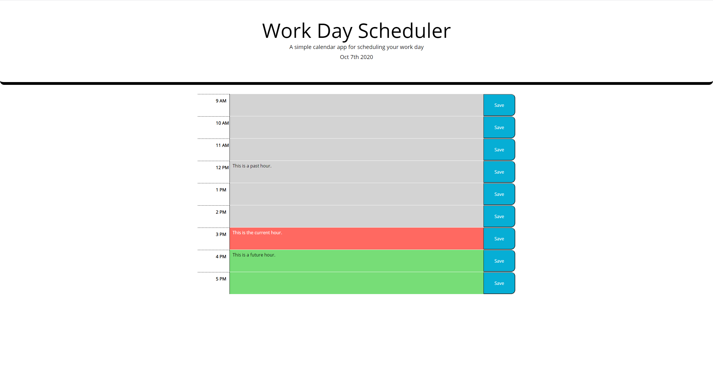

# Work Day Scheduler

## Description
This is a scheduler that shows the hours of a basic 9 to 5 work day. You type notes or reminders for each hour of the work day. The date at the top of the screen will also dynamically
update with the current date.

## Usage
Simply click in the center of each hour row and start typing our your notes for that hour. When you are finished you can hit the corresponding SAVE button for the row you just filled out,
this will save your notes to your browser's local storage and will remain even through a page refresh and closing the browser itself. The hours are color coded for:
- Grey: past hours
- Red: the current hour
- Green: future hours

## Website Link
[Work Day Scheduler](https://rgl10d.github.io/work-day-scheduler/)

## License
MIT License

Copyright © [2020] [Garrett Lee]

Permission is hereby granted, free of charge, to any person obtaining a copy
of this software and associated documentation files (the "Software"), to deal
in the Software without restriction, including without limitation the rights
to use, copy, modify, merge, publish, distribute, sublicense, and/or sell
copies of the Software, and to permit persons to whom the Software is
furnished to do so, subject to the following conditions:

The above copyright notice and this permission notice shall be included in all
copies or substantial portions of the Software.

THE SOFTWARE IS PROVIDED "AS IS", WITHOUT WARRANTY OF ANY KIND, EXPRESS OR
IMPLIED, INCLUDING BUT NOT LIMITED TO THE WARRANTIES OF MERCHANTABILITY,
FITNESS FOR A PARTICULAR PURPOSE AND NONINFRINGEMENT. IN NO EVENT SHALL THE
AUTHORS OR COPYRIGHT HOLDERS BE LIABLE FOR ANY CLAIM, DAMAGES OR OTHER
LIABILITY, WHETHER IN AN ACTION OF CONTRACT, TORT OR OTHERWISE, ARISING FROM,
OUT OF OR IN CONNECTION WITH THE SOFTWARE OR THE USE OR OTHER DEALINGS IN THE
SOFTWARE.

